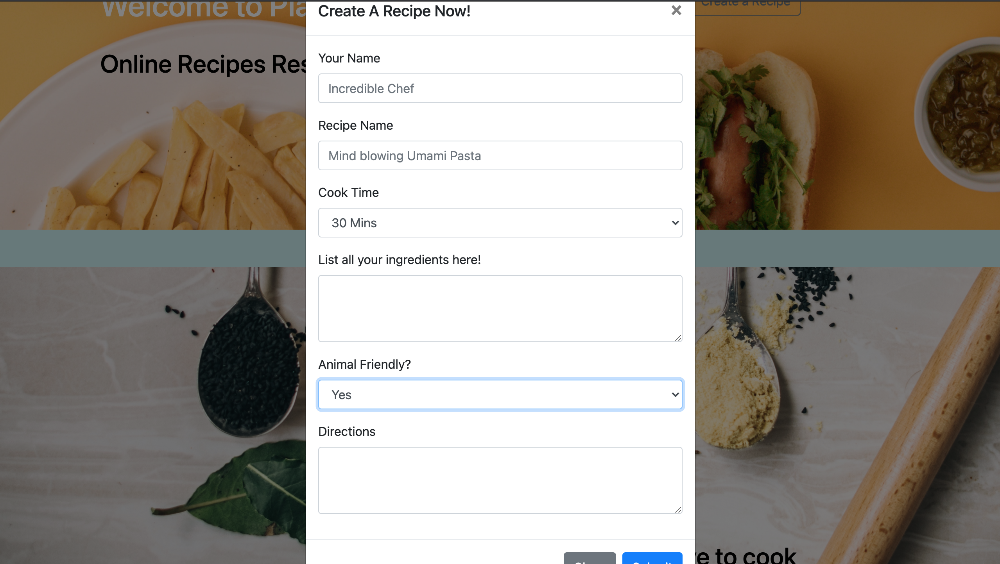

# PlatterUp
A quick API to grab cooks and recipes. The data will be sent as plain JSON at the /cooks route. There is an embedded relationship between cooks and recipes. There is a find or create check for duplicate names, the recipes will inhabit only one user (cook)

## Screenshots

### Pictures 
- Top Photo by Ball Park Brand on Unsplash
- Bottom Photo by Calum Lewis on Unsplash
- "A balanced diet is a cookie in each hand." - Barbara Johnson
